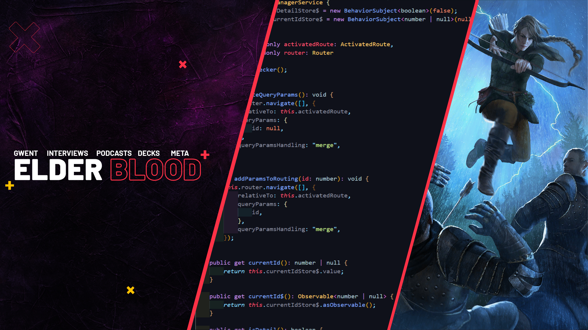

<link href="https://fonts.googleapis.com/css2?family=Raleway&display=swap" rel="stylesheet">

<h1 align="center"> 💫 About Me: </h1>

<h3 align="center">Computer Science student at the Silesian University of Technology | 4th Year 🎓  </h3>
<h4 align="center">
⚽ Football Enthusiast   |   🎮 Gaming Aficionado   |   🎥 Film Industry Buff  
🏆 Competitive Gwent Player     |     Team Elder Blood Member 🃏  
</h4>
Hello there! I'm a passionate Computer Science student in my final year at the Silesian University of Technology. Beyond code, you'll find me cheering for my favourite football team, diving into the latest gaming releases, and exploring the depths of the film industry.

In the virtual realm, I'm an active member of Team Elder Blood, a tight-knit community of top-tier Gwent players from around the globe. With some competitive successes under my belt, I'm always eager to tackle new challenges in the world of Gwent. Let's connect and level up together! 🚀

When I'm not immersed in tech or gaming, you'll catch me pounding the pavement, running around the world. Running isn't just a hobby for me; it's a passion that keeps me energized and focused. Let's lace up and hit the track together!

<h3 align="left">Connect with me:</h3>

<h3 align="left">Programming Languages:</h3>

 
  <a href="https://unrealengine.com/" target="_blank" rel="noreferrer"> 
    
<h3 align="left">Frontend Development:</h3>

 

 <a href="https://unrealengine.com/" target="_blank" rel="noreferrer"> 
     
<h3 align="left">Other Stuff:</h3>

 
 

<h4>✍️ Random Dev Quote</h4>

